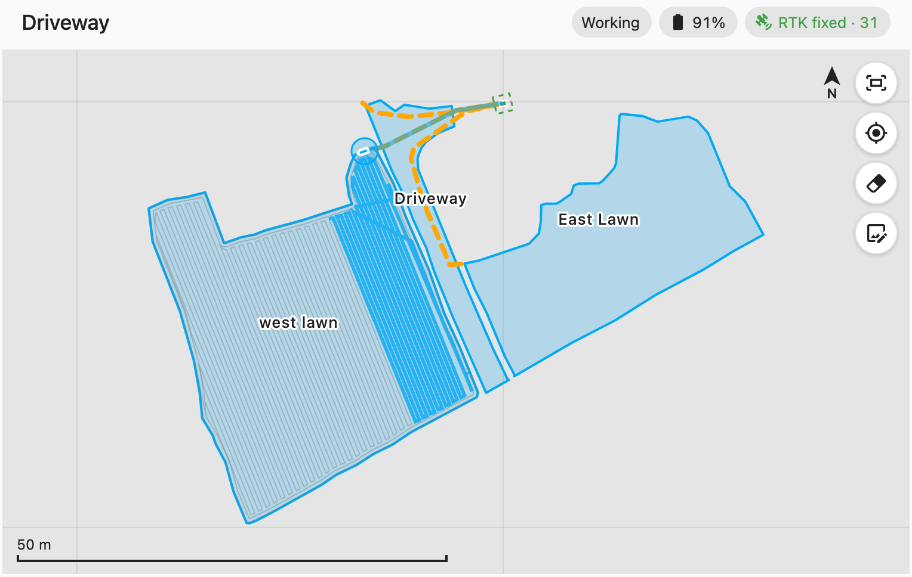

# Yarbo Local Card

A Home Assistant dashboard card for Yarbo robots, working with the [Yarbo Local](https://github.com/yarbo-local/yarbo-local-ha) integration. It draws the map stored on the robot, the robot moving on it, and an aerial photo of your property underneath if you give it one. Everything comes from the robot on your LAN through Home Assistant. The card loads no map tiles and talks to nothing on the internet.



## What it shows

- Work areas, no-go zones, no-vision zones, electronic fences, pathways and memory paths, with names. Tap one for its kind and size.
- The dock with its approach guard square.
- The robot's footprint and heading, updated up to twice a second while it is awake, greyed out while it sleeps.
- A trail of where it has driven since the page opened: thin while travelling, 55 cm wide while working, magenta while reversing.
- Plan progress, the return-to-dock route and the obstacles the robot reports, each kept for the run. All three message formats were checked against a real robot mowing and returning to its dock (firmware 3.14.11, Lawn Mower Pro).
- Faults by name: when the robot stops, the card says why ("Tilted or flipped over"), since when, and what to do, instead of "Error". A paused plan says why it paused.
- Status: activity, battery, RTK fix and satellites, and an offline warning when Home Assistant loses the robot.

Pan by dragging, zoom with the wheel or a pinch. The buttons fit the map, follow the robot, clear the trail, and, for admins, align an aerial photo.

## Aerial photo

1. Save a top-down photo of your property, for example a drone shot or a satellite screenshot you take yourself, as `/config/www/yarbo/aerial.jpg`. Home Assistant serves it at `/local/yarbo/aerial.jpg`.
2. On the card, press the photo button, load the image, then tap a landmark on the photo and the same landmark on the map, twice. Map taps snap to zone corners and the dock.
3. Check the fit, set the opacity, and save. The alignment is stored in Home Assistant, so every dashboard and device shows the same result.

## Install

HACS: add `https://github.com/yarbo-local/yarbo-local-card` as a custom repository of type Dashboard, install, and reload the browser. Manual: copy `dist/yarbo-local-card.js` to `/config/www/yarbo-local-card/` and add it as a JavaScript module resource.

Requires the Yarbo Local integration 0.1 or newer and Home Assistant 2026.7 or newer.

```yaml
type: custom:yarbo-local-card
entity: device_tracker.yarbo_1234567890abcdef_location
title: Driveway
height: 480
trail: true
follow: false
show_status: true
```

`entity` can be any entity of the robot. The card finds the robot from it.

## Develop

```bash
npm install
git config core.hooksPath .githooks   # leak check for demo data, see yarbo-local
npm run dev     # demo page with a mocked Home Assistant at http://localhost:5174
npm run check   # typecheck, tests, build
```

The robot's map frame is metres with x pointing west and y pointing north. The card draws east to the right and north up, which is a half turn, not a mirror; `src/geometry.ts` holds the conversion and its tests.

## License

MIT. Dock and robot outline dimensions come from the steves2j Yarbo map card (MIT). Yarbo is a trademark of its owner; this project is not affiliated with it.
